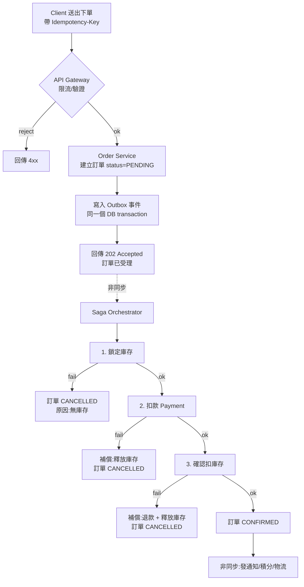
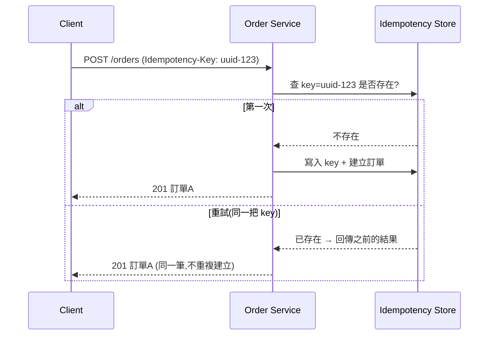
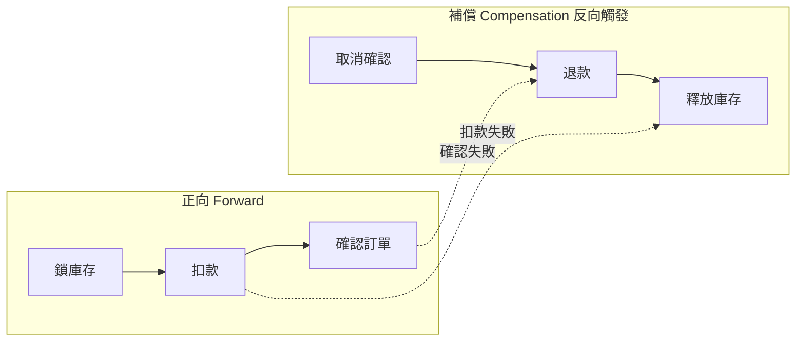
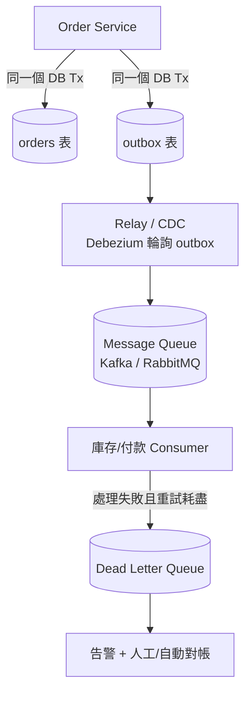
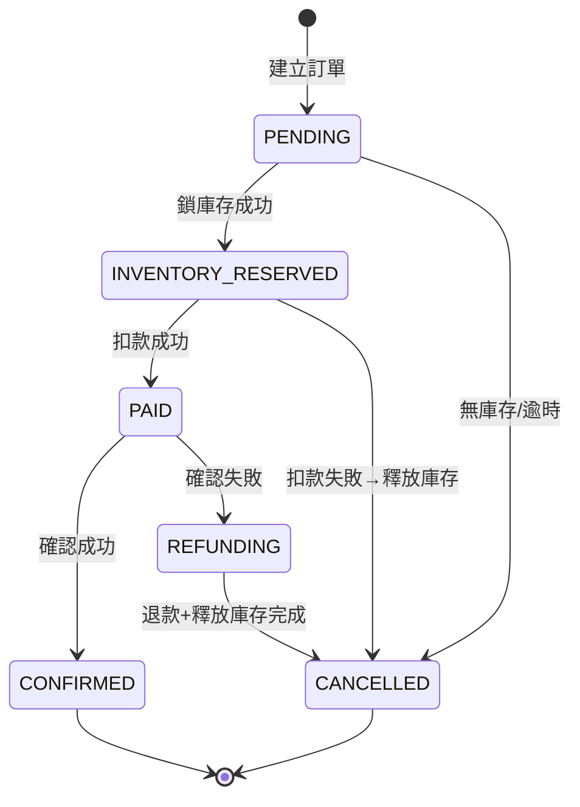

系統設計

下訂單fail了

這種情形應該要怎麼設計處理?
畫圖

---

# 下訂單失敗 (Order Placement Failure) 系統設計

## 0. 問題本質

下訂單通常會橫跨多個服務,任何一步都可能失敗:

```
Client → API Gateway → Order Service → Inventory Service
                                     → Payment Service
                                     → Coupon Service
                                     → Notification Service
```

> 它是一個 **分散式交易 (distributed transaction)**。
> 設計目標不是「永不失敗」,而是「失敗後系統能回到一致狀態,且使用者不會被重複扣款或重複下單」。

---

## 1. 先分類:在哪裡 fail?

```
                     ┌─────────────────────────────────────────┐
                     │              失敗點分類                   │
                     └─────────────────────────────────────────┘

 (A) Client → Server 之間                  網路 timeout、Client 不知道成功與否
 (B) Order 建立後、付款前                   下單成功但還沒扣款
 (C) Payment 失敗                          餘額不足、信用卡拒絕、第三方 timeout
 (D) Payment 成功但 Inventory 扣庫存失敗     錢扣了但沒貨 → 最危險
 (E) 全部成功但通知/後續步驟失敗             不影響交易,可非同步補
```

不同失敗點,處理策略不同 → 這就是為什麼要用 **Saga + 狀態機**。

---

## 2. 整體流程圖 (Happy Path + 失敗分支)



重點:**Step C 回傳給 client 的是 `202 Accepted`(已受理),不是「已完成」**。真正的扣款/扣庫存在背景的 Saga 完成,使用者透過「訂單狀態」查詢結果。

---

## 3. 關鍵設計 1 — 冪等性 (Idempotency)

針對 **失敗點 (A)**:client 送出後 timeout,它不知道到底成不成功,於是重送 → 不能變成兩筆訂單。



- Client 每次「邏輯上的一次下單」產生一個 **Idempotency-Key**(UUID)。
- Server 用 `UNIQUE(idempotency_key)` 落庫,重複請求回傳相同結果。
- Payment 對第三方也要帶 idempotency key,避免重複扣款。

---

## 4. 關鍵設計 2 — Saga 補償交易 (處理 D 這種最危險的情況)

不要用 2PC / 分散式鎖(在高併發下會卡住、難擴展)。改用 **Saga**:每一步都有對應的「補償動作」,失敗就反向回滾。

```
正向流程            補償流程 (反向)
───────────────────────────────────────
1. 鎖定庫存    →    釋放庫存 (Release)
2. 扣款        →    退款 (Refund)
3. 確認出貨    →    取消出貨 (Cancel)
```



兩種風格:
| 風格 | 說明 | 適用 |
|------|------|------|
| **Orchestration (編排)** | 一個 Saga Orchestrator 集中控制每一步 | 流程複雜、需可視化、推薦 |
| **Choreography (協同)** | 各服務靠事件互相觸發,無中央控制 | 流程簡單、服務少 |

---

## 5. 關鍵設計 3 — 可靠投遞:Outbox + MQ + DLQ

問題:「訂單寫進 DB 成功,但發 MQ 訊息失敗」→ 後續步驟永遠不會被觸發。
解法:**Transactional Outbox**,把「寫訂單」和「寫事件」放進**同一個 DB transaction**。



- **Outbox**:保證「事件一定會被送出」(at-least-once)。
- **Consumer 冪等**:因為 at-least-once 會重送,消費端要去重(用 event_id)。
- **DLQ (死信佇列)**:重試 N 次仍失敗的訊息進 DLQ,觸發告警,不阻塞主流程。

---

## 6. 關鍵設計 4 — 訂單狀態機 (State Machine)

每筆訂單狀態明確,任何 crash 後都能從 DB 狀態恢復繼續跑 Saga。



---

## 7. 重試策略 (Retry / Timeout / Circuit Breaker)

針對 **失敗點 (C)** 第三方 timeout:

- **可重試 (transient)**:network timeout、5xx、429 → **指數退避 (exponential backoff + jitter)** 重試。
- **不可重試 (permanent)**:餘額不足、卡片無效、4xx → 直接走補償,不要重試。
- **Circuit Breaker**:第三方持續失敗時熔斷,快速失敗,避免雪崩。
- **Timeout**:每個外部呼叫都要設超時,超時當失敗處理(但要靠 idempotency key 防止「其實成功了」的重複)。

```
失敗 → 可重試? ──是──> backoff 重試 (max N 次) ──仍失敗──> 補償 + DLQ
              └─否──> 立即補償 (Saga rollback)
```

---

## 8. 對帳 (Reconciliation) — 最後一道防線

即使上面都做了,分散式系統仍可能有「灰色狀態」(扣款記錄有、訂單沒)。
跑**定時對帳 Job**:

- 掃描卡在中間狀態超過 X 分鐘的訂單 (e.g. `PAID` 但一直沒 `CONFIRMED`)。
- 與 Payment / Inventory 對帳,自動補償或人工介入。
- 這是兜底,不能當主要機制。

---

## 9. 給使用者的體驗 (UX)

- 下單回傳 `202`「訂單處理中」,前端輪詢或用 WebSocket/推播更新狀態。
- 失敗要給**明確原因**:無庫存 / 付款失敗 / 系統忙碌請稍後。
- 付款失敗但庫存已預留 → 給「保留 15 分鐘,請重新付款」。

---

## 10. 一句話總結

> 下單失敗的設計核心 = **冪等性 (不重複)** + **Saga 補償 (回到一致)** + **Outbox/MQ/DLQ (不遺失)** + **狀態機 (可恢復)** + **對帳 (兜底)**。
> 對外用 `202 + 狀態查詢` 取代「同步等到底」,把可靠性藏在背景非同步流程裡。
