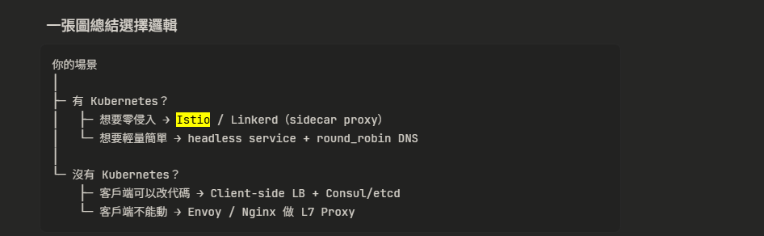

# gRPC 核心概念

## .proto 是什麼？

定義**介面契約**的檔案，描述有哪些 service 以及每個 function 的輸入輸出。

```proto
service Greeter {
  rpc SayHello (HelloRequest) returns (HelloReply) {}
}
message HelloRequest { string name = 1; }
message HelloReply   { string message = 1; }
```

---

## Stub 關係

由 `.proto` **自動生成**的程式碼，讓 client 可以像呼叫本地函式一樣呼叫遠端 server。

```
.proto  →  grpc_tools.protoc  →  hello_pb2.py + hello_pb2_grpc.py
                                          ↑
                                        stub 在這裡
```

| 檔案                | 內容                                                     |
| ------------------- | -------------------------------------------------------- |
| `hello_pb2.py`      | 資料結構（HelloRequest、HelloReply）                     |
| `hello_pb2_grpc.py` | stub（`GreeterStub`）和 server 介面（`GreeterServicer`） |

---

## Server / Client 誰負責寫？

| 角色              | 負責                                             |
| ----------------- | ------------------------------------------------ |
| **兩邊共同**      | 定義 `.proto`（介面契約，要先談好）              |
| **Server 開發者** | 實作 `GreeterServicer`（實際邏輯）               |
| **Client 開發者** | 用 `GreeterStub` 呼叫（只需 `.proto` 生成 stub） |

> `.proto` 是唯一需要共享的東西，server 跟 client 可以用**不同語言**各自生成 stub。

---

## gRPC vs REST API

|          | REST API            | gRPC                               |
| -------- | ------------------- | ---------------------------------- |
| 傳輸     | HTTP/1.1，JSON      | HTTP/2，Protocol Buffers（二進位） |
| 呼叫方式 | URL + HTTP verb     | 直接呼叫 function（像本地函式）    |
| 定義方式 | 無強制規範          | 用 `.proto` 定義介面               |
| 型別安全 | 無（JSON 是字串）   | 有（proto 強型別）                 |
| 速度     | 較慢                | 快（二進位 + HTTP/2）              |
| 可讀性   | 高（人看得懂 JSON） | 低（binary，需工具）               |

---

## 哪些是人寫的？哪些是工具生成的？

### 人寫的（需要維護）

| 檔案             | 說明                                  |
| ---------------- | ------------------------------------- |
| `hello.proto`    | 介面定義，唯一需要維護的契約          |
| `server.py`      | 實作邏輯（繼承 Servicer，寫商業邏輯） |
| `client.py`      | 呼叫邏輯（用 Stub 發請求）            |
| `pyproject.toml` | 套件依賴                              |
| `Dockerfile`     | 容器設定                              |

### 工具自動生成的（不要手改）

| 檔案                | 由誰生成                             |
| ------------------- | ------------------------------------ |
| `hello_pb2.py`      | `grpc_tools.protoc` 從 `.proto` 編譯 |
| `hello_pb2_grpc.py` | `grpc_tools.protoc` 從 `.proto` 編譯 |
| `__pycache__/`      | Python 執行時產生                    |
| `uv.lock`           | `uv` 解析依賴時產生                  |
| `.venv/`            | `uv sync` 產生                       |

### 流程

```
你寫 hello.proto
    ↓  generate_proto.py（跑一次就好，proto 有改才需要重跑）
自動生成 hello_pb2.py + hello_pb2_grpc.py
    ↓
你寫 server.py  ← import 生成的檔案來用
你寫 client.py  ← import 生成的檔案來用
```

Q : 所以 gRPC 是後端間的溝通 還是前後端？
A: **主要是後端間（微服務之間）**。
瀏覽器原生不支援 gRPC（HTTP/2 framing 被瀏覽器封鎖），所以前後端通常還是用 REST 或 GraphQL。
若要讓瀏覽器用 gRPC，需要額外加 **gRPC-Web** proxy 層，比較麻煩。
實務上的常見架構：

```
Browser → REST/GraphQL → API Gateway → gRPC → 微服務 A
                                             → gRPC → 微服務 B
```

Q: 流量省多少？
A: 一般省 **30%～80%**，取決於資料結構。
Protocol Buffers 用欄位編號代替欄位名稱，用二進位編碼數字，所以比 JSON 小很多。

```
JSON :  {"name": "Alex", "age": 30, "active": true}  → 約 36 bytes
Protobuf:                                             → 約 11 bytes（省 ~70%）
```

| 資料類型              | 節省幅度 |
| --------------------- | -------- |
| 簡單物件              | 30～50%  |
| 數字密集（int/float） | 60～80%  |
| 純文字內容            | 10～20%  |

> 注意：REST + gzip 壓縮後差距縮小到 10～20%。
> gRPC 更大的優勢是 **HTTP/2 多路複用**，同一條連線可同時跑多個 request。


1. 架構選型與協議底層 (Architecture & Protocol)
這類問題旨在考驗你是否能在不同的業務場景中，選擇最合適的通訊協議。

面試題：在設計微服務架構時，什麼時候該選 gRPC？什麼時候該選 REST 或 GraphQL？

設計考點： 面試官想聽到的不是單純的「gRPC 比較快」。你需要點出 gRPC 適合「後端對後端 (Backend-to-Backend) 的微服務通訊」、「需要雙向串流 (Bi-directional streaming) 的場景」，以及「多語言環境下的強型別合約 (Polyglot environments)」。

Reference： 在高階系統設計 (HLD) 面試中，這通常是 API 設計環節的第一道防線。必須明確說出 REST 存在 Over-fetching 或 Under-fetching 的問題，而 gRPC 透過 Protobuf 解決了傳輸體積與解析速度的瓶頸。

面試題：gRPC 為什麼比傳統的 HTTP/1.1 REST API 快？

設計考點： 必須精準回答出 HTTP/2 的多工處理 (Multiplexing) 以及 Protobuf 的二進位序列化。

Reference： 許多面試者只知道 Protobuf，卻忽略了 HTTP/2 允許在單一 TCP 連線上同時交錯發送多個請求與回應，解決了 HTTP/1.1 的隊頭阻塞 (Head-of-Line Blocking) 問題。

2. 負載均衡 (Load Balancing) - 經典必考題
因為 gRPC 的底層連線機制，傳統的負載均衡器在遇到 gRPC 時常常會失效，這是系統設計面試的超級熱區。

面試題：在系統架構中，你要如何對 gRPC 服務做負載均衡？傳統的 L4 (Layer 4) Load Balancer 會有什麼問題？

設計考點： 這是一刀斃命的關鍵題。gRPC 基於 HTTP/2，會建立「持久連線 (Persistent Connection)」。如果使用 L4 負載均衡器（只看 IP 和 Port），它只會在「連線建立」時做一次分配。這會導致同一個客戶端的所有請求，都只會打到同一台後端伺服器上，完全失去負載均衡的效果。

解答方向： 必須回答使用 L7 (Layer 7) 代理負載均衡 (Proxy Load Balancing) （如 Envoy、Nginx）來解析 HTTP/2 封包並以「請求 (Request)」為單位做分配，或是採用 客戶端負載均衡 (Client-side Load Balancing / Lookaside LB)。

L4 為什麼失效？
L4 LB 看到的世界只有：
Client IP:Port → Server IP:Port
它的工作是：當一條新 TCP 連線進來時，決定要轉給哪台後端。
問題是，gRPC 客戶端只建立一次 TCP 連線，之後的所有請求都在這條連線上跑。L4 LB 在連線建立時把你分配給 Server A，之後就再也沒有介入的機會了。Server B、C 永遠閒著。
Client
  │
  │ 建立一次 TCP 連線
  ▼
L4 LB ──→ Server A  ← 所有流量
           Server B  ← 閒置
           Server C  ← 閒置

L7 多了什麼？
L7 LB（如 Envoy）能解析到應用層協定，也就是它能讀懂 HTTP/2 的幀（Frame）格式。
這讓它知道：「喔，這條 TCP 連線裡面現在來了一個新的 Stream ID 5，這是一個新的 gRPC 請求。」
它就可以在每一個 gRPC 請求這個粒度上做路由決策，而不是在 TCP 連線層級。
Client
  │
  │ 建立一次 TCP 連線（跟 Envoy）
  ▼
L7 Envoy
  │
  ├─ gRPC Request 1 (Stream 1) ──→ Server A
  ├─ gRPC Request 2 (Stream 3) ──→ Server B
  └─ gRPC Request 3 (Stream 5) ──→ Server C
Envoy 在自己跟每台後端之間，各自維護獨立的 HTTP/2 連線池，把進來的 Stream 拆開再分配出去。


3. 可靠性設計與測試 (Reliability & Testing)
針對 SDET 或是負責基礎建設的工程師，面試官會極度關心你如何處理分散式系統中的「網路不穩定」與「容錯」。

面試題：在分散式系統中，如果遠端 gRPC 服務沒有回應，你會如何設計防禦機制？

設計考點： 絕對不能只回答「寫 Try-Catch」。面試官期待聽到 Deadline (絕對超時時間) 的概念，這比傳統的 Timeout (相對時間) 更適合連鎖的微服務呼叫，可以避免資源被長時間卡死。另外，也要提到 重試機制 (Retry Policy) 與 斷路器模式 (Circuit Breaker)。

面試題：在建立自動化測試平台時，你該如何對依賴 gRPC 的服務進行單元測試與整合測試？

設計考點： 測試 gRPC 服務不應該每次都發起真實網路請求。你需要說明如何使用 Mocking 技術（例如攔截 gRPC Stub 的呼叫），或者架設一個輕量級的 gRPC Mock Server 來模擬各種極端狀況（如延遲回應、回傳特定的 gRPC 錯誤碼）。